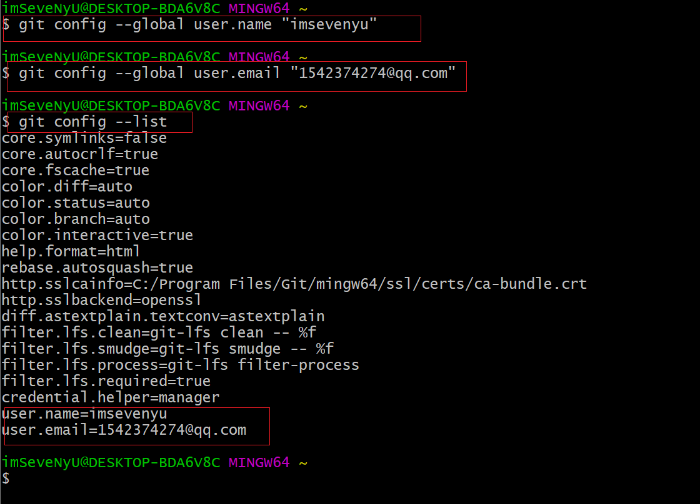
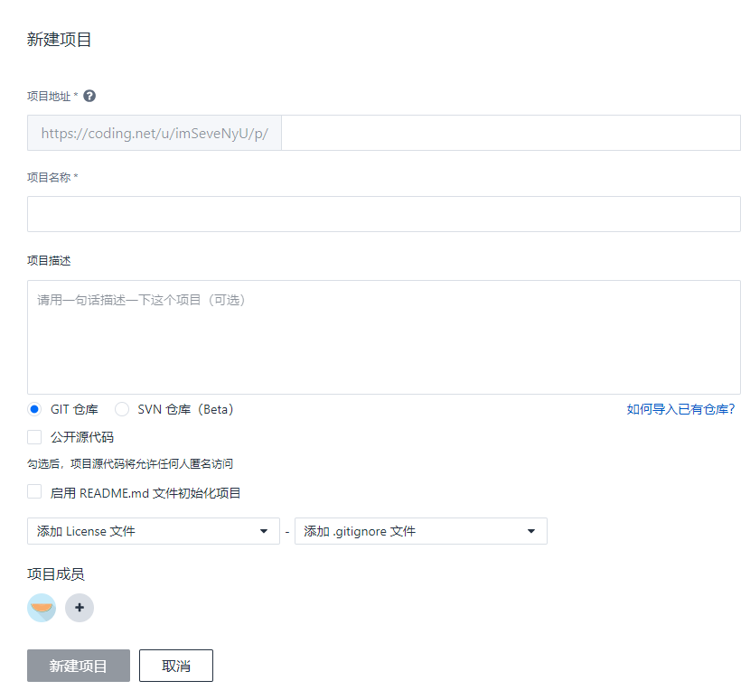
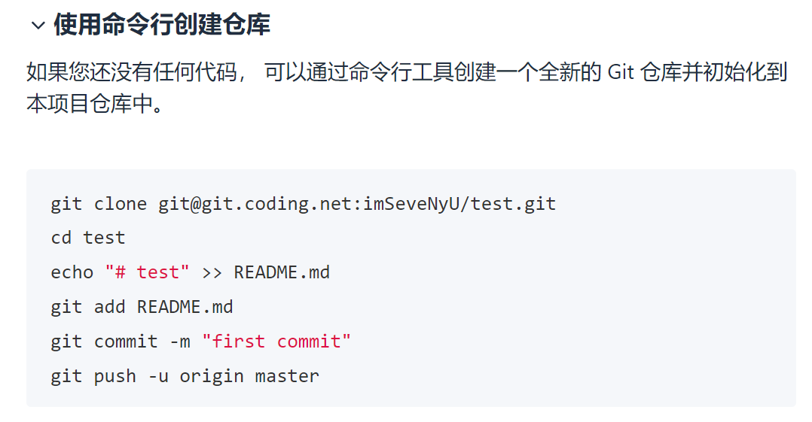
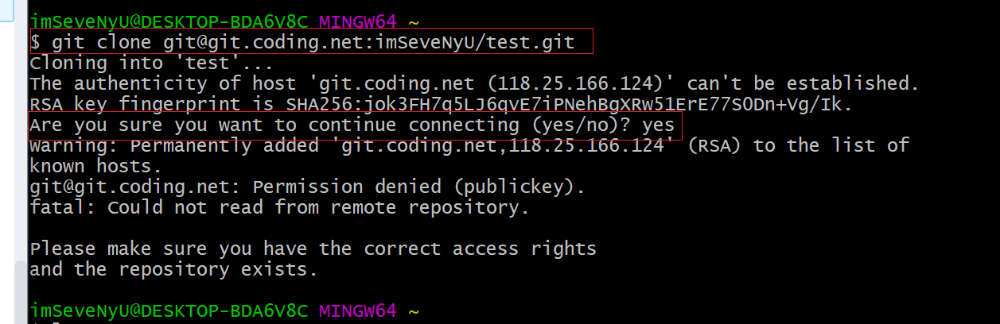
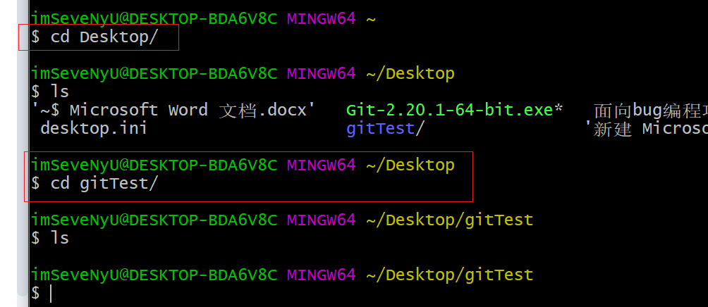
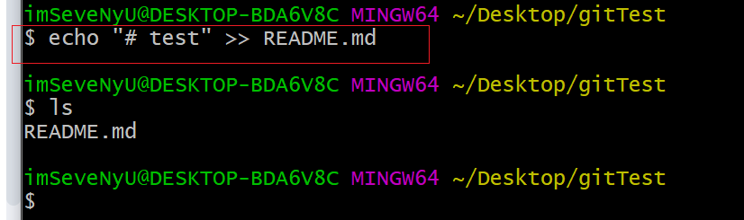
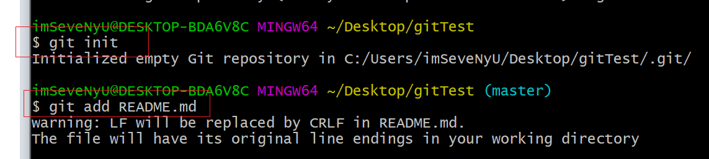
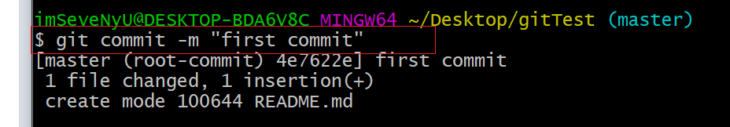
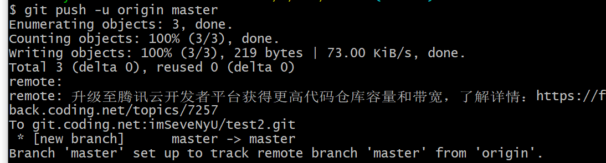

### Git介绍

版本控制系统主流的有SVN（集中式版本控制系统）和Git（分布式版本控制系统）

**SVN**

集中式代码管理的核心是服务器，所有开发者在开始新一天的工作之前必须从服务器获取代码，然后开发，最后解决冲突，提交。所有的版本信息都放在服务器上。


**Git**

分布式相比于集中式的最大区别在于开发者可以提交到本地，每个开发者通过克隆（git clone），在本地机器上拷贝一个完整的Git仓库。


Git是一种分布式版本控制系统。

它的主要功能是代码版本管理、多人协作开发

git代码托管平台 目前全球最大的是GitHub，国内的有 coding.net 和 码云

### Git常用命令速查表

**常用**

```
    $ git add .                 #跟踪所有改动过的文件   
    $ git checkout --README.md  #撤销README.md文件在工作区的修改（滚回到最近一次git commit或git add试的状态）
    $ git commit -m "commit messages"    #提交所有更新过的文件
    $ git push origin master	#代码提交到远程仓库master分支
    $ git pull origin master	#拉取服务器master分支的代码到本地
    $ git branch				#查看当前分支（*）
    $ git checkout -b           #新建一个分支
    $ git checkout <branch/tag> #切换到指定分支和标签
    $ git merge <branch>        #合并指定分支到当前分支
```


创建版本库

    $ git clone <url>                  #克隆远程版本库
    $ git init                         #初始化本地版本库

修改和提交

    $ git status                       #查看状态
    $ git diff                         #查看变更内容
    $ git add .                        #跟踪所有改动过的文件
    $ git add <file>                   #跟踪指定的文件
    $ git mv <old><new>                #文件改名
    $ git rm<file>                     #删除文件
    $ git rm --cached<file>            #停止跟踪文件但不删除
    $ git commit -m "commit messages"  #提交所有更新过的文件
    $ git commit --amend               #修改最后一次改动

查看提交历史

    $ git log                    #查看提交历史
    $ git log -p <file>          #查看指定文件的提交历史
    $ git blame <file>           #以列表方式查看指定文件的提交历史


撤销

    $ git reset --hard HEAD      #撤销工作目录中所有未提交文件的修改内容
    $ git checkout HEAD <file>   #撤销指定的未提交文件的修改内容
    $ git revert <commit>        #撤销指定的提交
    $ git log --before="1 days"  #退回到之前1天的版本

分支与标签

    $ git branch                   #显示所有本地分支
    $ git checkout <branch/tag>    #切换到指定分支和标签
    $ git branch <new-branch>      #创建新分支
    $ git branch -d <branch>       #删除本地分支
    $ git tag                      #列出所有本地标签
    $ git tag <tagname>            #基于最新提交创建标签
    $ git tag -d <tagname>         #删除标签

合并与衍合

    $ git merge <branch>        #合并指定分支到当前分支
    $ git rebase <branch>       #衍合指定分支到当前分支

远程操作

    $ git remote -v                   #查看远程版本库信息
    $ git remote show <remote>        #查看指定远程版本库信息
    $ git remote add <remote> <url>   #添加远程版本库
    $ git fetch <remote>              #从远程库获取代码
    $ git pull <remote> <branch>      #下载代码及快速合并
    $ git push <remote> <branch>      #上传代码及快速合并
    $ git push <remote> :<branch/tag-name>  #删除远程分支或标签
    $ git push --tags                       #上传所有标签


### git使用

**1.注册git账号**

由于GitHub在国内访问不稳定，并且全是英文，对新手不友好。所以初步上手可以选择coding.net

**2.安装git**

	windows环境 ，前往 Git官网 下载安装
	
	mac环境 通过命令行安装

**3.配置用户名和邮箱**

    $ git config -global user.name "youname"	#用户名
    $ git config -global user.email "xxxxxx@xx.XX"	#邮箱账号（与注册的git账号邮箱一致）
    $ git config --list    #查看是否配置成功



补充：我们还需要生成一个公匙

```
   $ ssh-keygen -t rsa -C <your_email@example.com>
```
然后在我们的账户中新增公匙。这样才能连接到仓库

**4.使用命令行新建仓库**
输入项目地址和项目名称后点击 新建项目


跟着coding引导一步步来

这些命令一步步配置，下面是截图
克隆git仓库到本地（注意这里的imSeveNyU/test.git要更改成youname/项目名.git）

下面这一步是进入项目文件夹，我这里进入的是桌面上的gitTest文件夹。 cd 命令就是切换到哪个文件夹下

这里新建了一个README.md的文件，下面用ls命令可以看到该文件创建成功

下面git init命令是将安装到这个文件夹  git add README.md是增加README.md文件

Git commit将我更改的提交到本地仓库  --m “xxx” 中—是参数的意思 后面是备注也就是描述我这里做了哪些更改。

提交到master主分支 git push -u origin master
